# 基于springboot的校园二手书交易系统带万字文档

## 一、介绍

技术栈：Java、Mysql、SpringBoot、Mybatis-Plus、Vue、Html

系统角色：用户 管理员

用户：注册 登录 首页 公告信息 图书 图书求购 个人中心 购物车 图书下单 图书订单 用户反馈

管理员：登录 用反馈管理 公告类型管理 图书类型管理 公告信息管理 图书管理 图书留言管理 图书订单管理 图书求购管理 用户管理 轮播图管理

### 完整项目获取

通过网盘分享的文件：校园二手书交易系统

链接: https://pan.baidu.com/s/1f-H7OY3O9ks6WFf32w918A?pwd=hpxq 提取码: hpxq
--来自百度网盘超级会员v3的分享

通过网盘分享的文件：工具包

链接: https://pan.baidu.com/s/1YmdoJvkjoUjA75wvHLDZ6A?pwd=xm96 提取码: xm96
--来自百度网盘超级会员v3的分享

需要远程项目部署或项目修改和毕业设计也可联系（添加申请时请备注好来意）

通过网盘分享的文件：远程调试部署联系方式

链接: https://pan.baidu.com/s/1W0dDcoZmayG0c7USJDYBYg?pwd=nqd7 提取码: nqd7
--来自百度网盘超级会员v3的分享

### 项目合集(项目不断更新中)
链接: https://pan.baidu.com/s/1nY-zhvAK0CXYcn3g7LzQnQ?pwd=id3c 提取码: id3c
--来自百度网盘超级会员v3的分享

#### 这些项目一起发你了 可以分享给你需要的同学 调试可找我 也接二次修改和项目定制、毕业设计等

## 接毕业设计和论文

微信联系方式：xzxj0206  QQ：3808981644   (支持修改、 部署调试、 支持代做毕设)

接网站建设、小程序、H5、APP、各种系统等，单片机、嵌入式也可以做

选题+开题报告+任务书+程序定制+安装调试+论文+答辩ppt  都可以做

## 二、万字论文

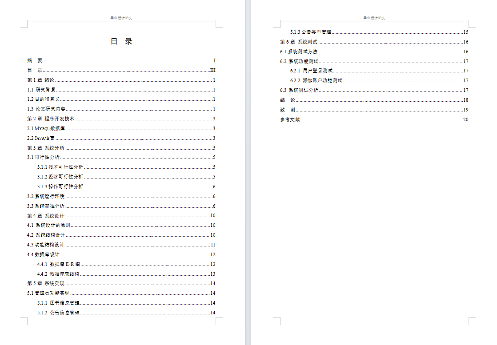

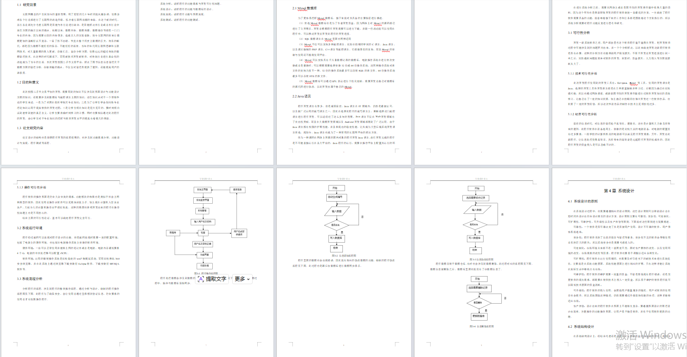

## 三、部分页面截图展示

### 1、用户

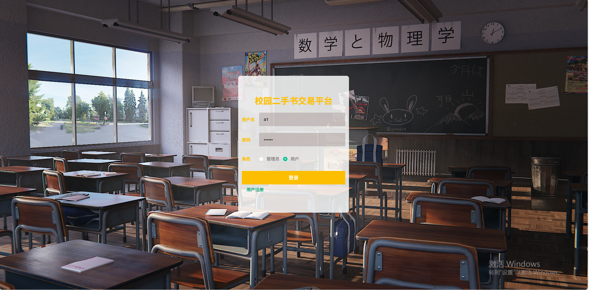

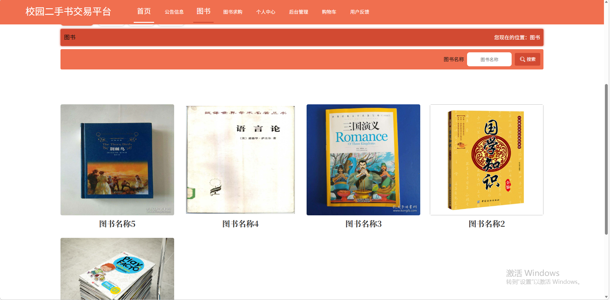

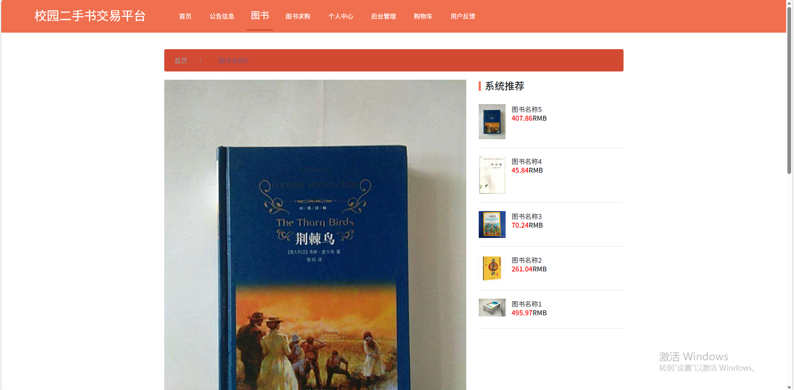

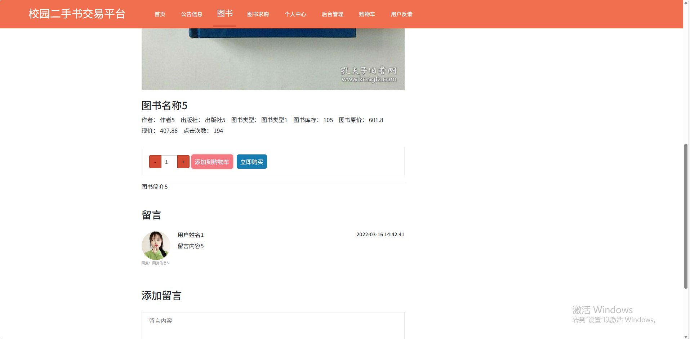

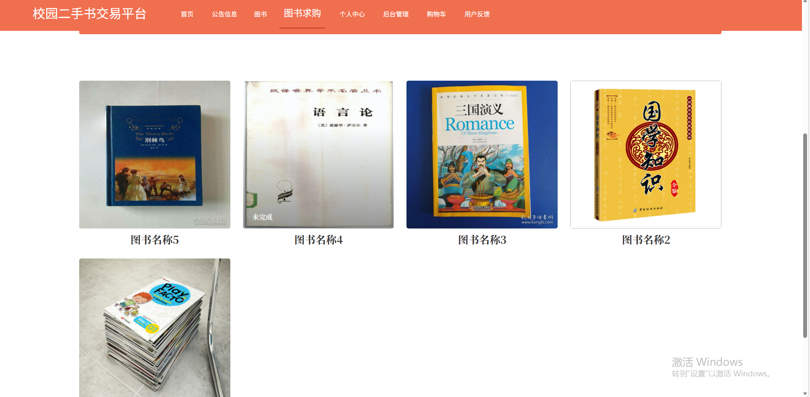

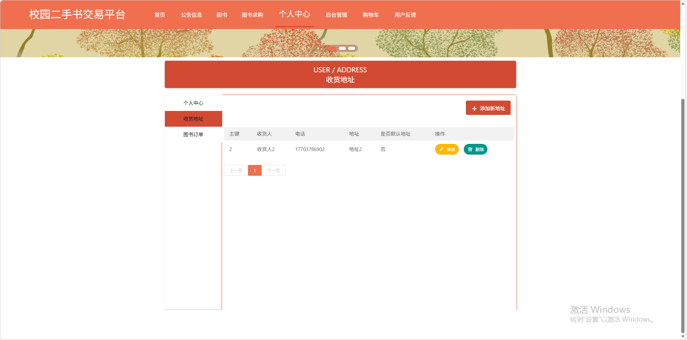

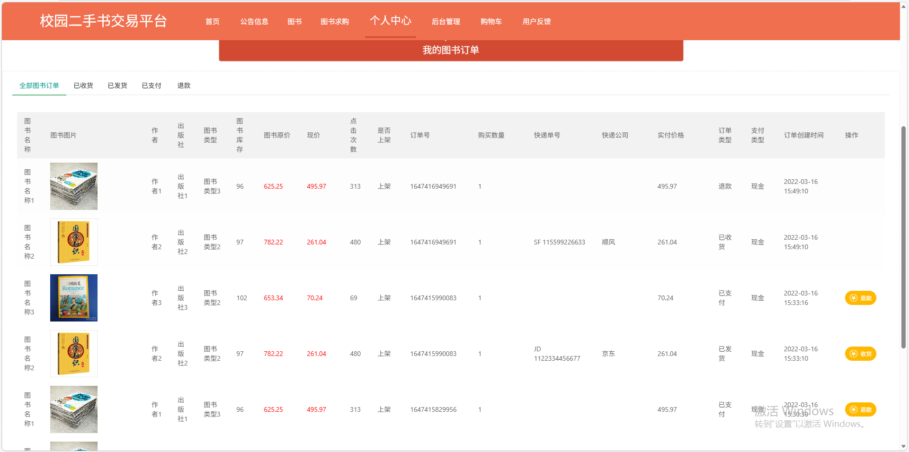

### 2、管理员

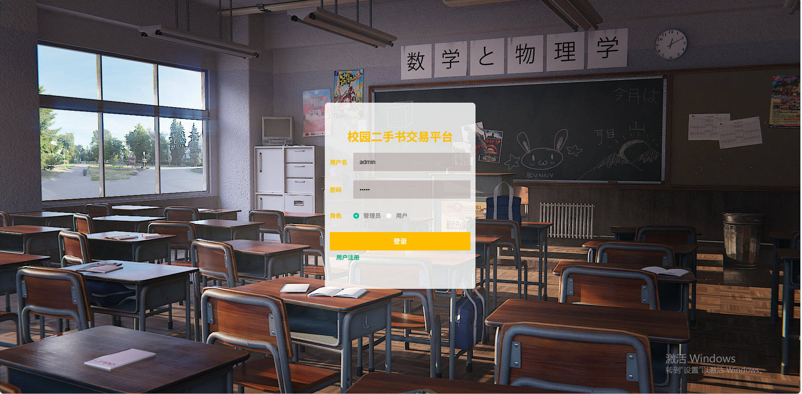

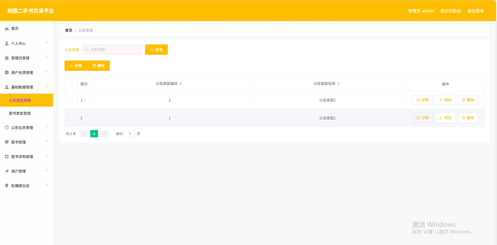

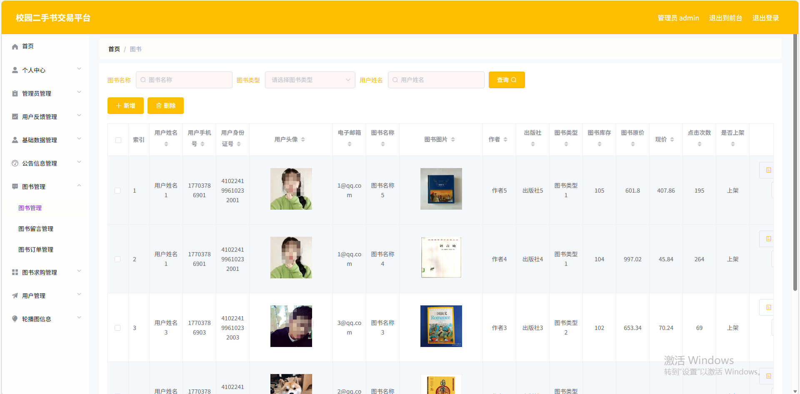

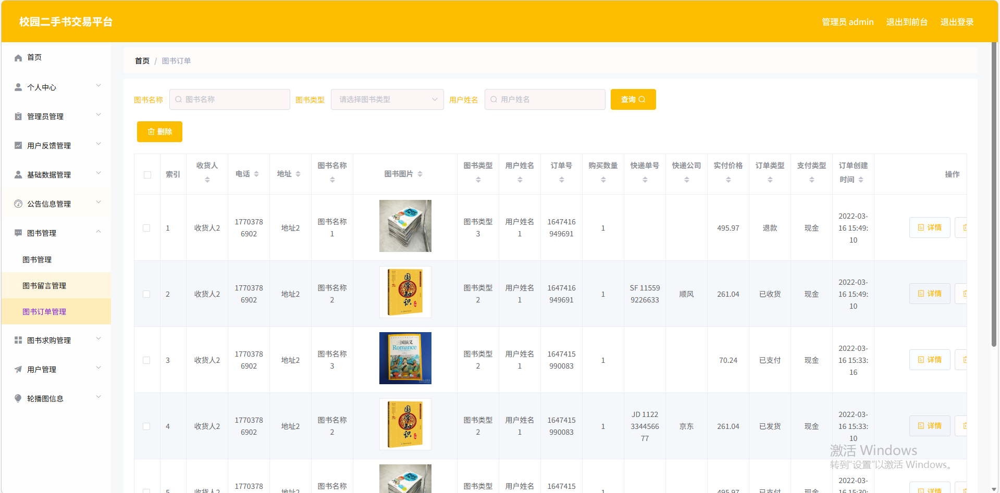

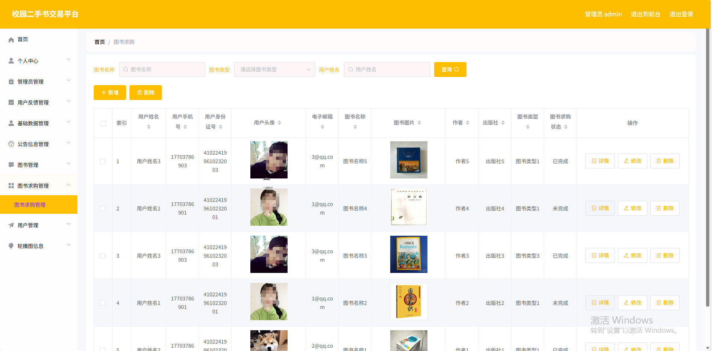